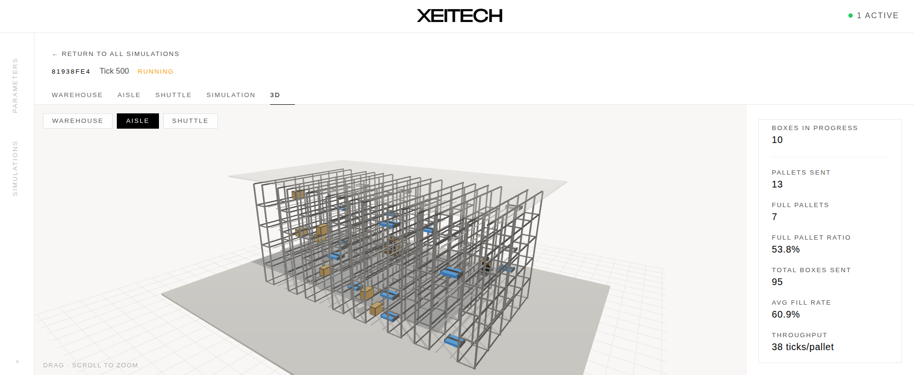

# XEITECH — Inditex Challenge, HackUPC 2026

XEITECH is a full-stack automated warehouse simulator built for the Inditex
challenge at HackUPC 2026. Boxes arrive on an input belt, are sorted and stored
in numbered aisles by autonomous shuttles, and are later retrieved and packed
onto pallets by a robotic arm. The whole pipeline runs as a discrete-event
simulation that can be played back at any speed in a 3D browser view.

The project exists to show that a warehouse control system can be modelled as a
clean, testable event log — separated from wall-clock time — so that operators
can explore "what-if" scenarios faster than real time and rewind to inspect
decisions.



---

## Pipeline overview

```
CSV file / live parameters
          │
          ▼
┌─────────────────────┐
│   Input belt        │  Boxes arrive with family, weight, dimensions
└──────────┬──────────┘
           │  store
           ▼
┌─────────────────────┐
│  Aisles (silos)     │  Shuttles place and retrieve boxes
│  shuttle · shuttle  │  using a placement heuristic
└──────────┬──────────┘
           │  retrieve
           ▼
┌─────────────────────┐
│  Robot arm          │  Picks boxes and fills pallets (capacity 12)
│  → Pallets          │  dispatched when full or on flush
└──────────┬──────────┘
           │  event log (logical timestamps)
           ▼
┌─────────────────────┐
│  FastAPI backend    │  REST + WebSocket; runs C++ in a thread pool
└──────────┬──────────┘
           │  WebSocket stream
           ▼
┌─────────────────────┐
│  React frontend     │  3D view, controllable virtual clock
└─────────────────────┘
```

---

## Features

- Discrete-event C++17 simulation engine — pure logic, no wall-clock dependency,
  fully testable and deterministic.
- Two execution modes: **batch** (run as fast as possible, return metrics) and
  **visualization** (stream events to the browser at a configurable playback speed).
- Concurrent simulations: the FastAPI backend runs each C++ call in a thread pool
  with GIL released, so multiple simulations execute truly in parallel.
- 3D warehouse visualization with Three.js — watch shuttles move boxes in real time.
- Controllable virtual clock: speed up, slow down, pause, or resume mid-simulation.
- Configurable parameters: number of aisles, shuttle count, robot speed, pallet
  capacity, input rate, and more.
- Docker Compose deployment — build once with CMake, then run the full stack with a single command.
- CSV input support: provide your own box inventory or use the bundled sample data.

---

## Quick start

### Option A — Docker Compose (recommended)

Requires CMake 3.14+, a C++17 compiler, Docker 24+, and Docker Compose v2.

The Docker image builds the pybind11 module inside the container, so you must
compile the C++ engine with CMake first so that the shared library is available
when the image is assembled:

```bash
git clone https://github.com/igarbayo/HackUPC-2026.git
cd HackUPC-2026
cmake -S backend/cpp -B backend/cpp/build
cmake --build backend/cpp/build
docker compose up
```

Then open `http://localhost:3000` in your browser.

The backend API is available at `http://localhost:8000`. Interactive API docs
are at `http://localhost:8000/docs`.

To use a custom CSV file instead of the bundled sample:

```bash
docker compose run --rm -v /path/to/your/boxes.csv:/app/silo.csv backend
```

### Option B — Manual setup

#### 1. Build the C++ engine

Requires CMake 3.14+ and a C++17-capable compiler (see [Compatibility](#compatibility)).

```bash
cd backend/cpp
cmake -S . -B build
cmake --build build
```

This produces:
- `build/silos` — interactive demo (runs in your terminal)
- `build/bench` — benchmark runner

#### 2. Install Python dependencies

Requires Python 3.10+.

```bash
cd backend/python
pip install -r requirements.txt
```

#### 3. Run the backend

The pybind11 `.so` built in step 1 must be on `PYTHONPATH`:

```bash
cd backend/python
PYTHONPATH=/absolute/path/to/HackUPC-2026/backend/cpp/build \
    uvicorn main:app --reload --port 8000
```

#### 4. Run the frontend

Requires Node.js 18+ and npm.

```bash
cd frontend
npm install
NEXT_PUBLIC_API_URL=http://localhost:8000 npm run dev
```

Open `http://localhost:3000`.

---

## Usage examples

### Launch a simulation via the API

```bash
curl -X POST http://localhost:8000/simulations \
  -H "Content-Type: application/json" \
  -d '{
    "num_aisles": 10,
    "num_shuttles": 2,
    "num_robots": 1,
    "speed": 1.0
  }'
```

The response contains a `simulation_id`. Use it to connect via WebSocket:

```
ws://localhost:8000/ws/{simulation_id}
```

Events arrive as JSON objects: `{ "type": "BOX_STORED", "t": 1.23, "box_id": 7, "aisle": 3 }`.

### Run the standalone C++ demo

```bash
./backend/cpp/build/silos
```

This runs a simulation directly in the terminal, printing the event log to stdout.
Useful for rapid iteration on the engine without starting the full stack.

### Run the benchmark

```bash
cd backend/cpp
./build/bench | python3 benchmark/compare.py
```

Prints a comparison table of scheduler performance across different parameter sets.

### Run the C++ test suites

```bash
./backend/cpp/run_tests.sh          # all suites
./backend/cpp/run_tests.sh -n       # skip rebuild, run only
./backend/cpp/run_tests.sh test_robot  # single suite
```

### Run the Python tests

```bash
cd backend/python
pytest
```

---

## Configuration

### Docker Compose environment variables

| Variable | Default | Description |
|---|---|---|
| `FRONTEND_ORIGIN` | `*` | Allowed CORS origin for the backend |
| `NEXT_PUBLIC_API_URL` | `http://localhost:8000` | Backend URL used by the frontend at build time |

Set them in a `.env` file at the repository root or pass them directly to `docker compose`:

```bash
FRONTEND_ORIGIN=https://myhost.example docker compose up
```

### Manual run environment variables

| Variable | Required | Description |
|---|---|---|
| `PYTHONPATH` | Yes | Path to the directory containing the compiled `silos_cpp*.so` |
| `PORT` | No | Override the uvicorn port (default `8000`) |

---

## Compatibility

| Component | Minimum version | Tested on |
|---|---|---|
| GCC | 8 | 12, 13 |
| Clang | 7 | 14, 17 |
| MSVC | 2017 (v141) | 2022 |
| CMake | 3.14 | 3.28 |
| Python | 3.10 | 3.11, 3.12 |
| Node.js | 18 | 20, 22 |
| Docker | 24 | 25, 26 |
| Docker Compose | v2.0 | v2.24 |
| Ubuntu | 20.04 | 22.04, 24.04 |
| macOS | 12 (Monterey) | 13, 14 |

The C++ engine has no external runtime dependencies beyond the standard library.
The Python backend runs on any platform where `uvicorn` and `pybind11` are available.

---

## Troubleshooting

### `ImportError: No module named 'silos_cpp'` or `.so` not found

The C++ shared library is not on `PYTHONPATH`. Build the engine first and then
set the variable:

```bash
cd backend/cpp && cmake -S . -B build && cmake --build build
export PYTHONPATH=$(pwd)/build
```

If you see the error inside Docker, the image may not have been rebuilt after a
code change. Run `docker compose build backend` before `docker compose up`.

### `CMake Error: CMake 3.x or higher is required`

Your system CMake is too old. On Ubuntu:

```bash
sudo apt install cmake   # or install from cmake.org
cmake --version
```

On macOS with Homebrew: `brew install cmake`.

### Port 8000 or 3000 already in use

Another process is listening on the port. Find and stop it:

```bash
lsof -i :8000   # or :3000
kill <PID>
```

Or change the port in `docker-compose.yml` and set `NEXT_PUBLIC_API_URL` accordingly.

### Docker networking: frontend cannot reach backend

Inside Docker Compose, services communicate by service name, not `localhost`.
If you are overriding `NEXT_PUBLIC_API_URL` for a containerised frontend, use
the service name:

```yaml
NEXT_PUBLIC_API_URL: http://backend:8000
```

`localhost` only works when the frontend runs on the host machine and the
backend is exposed via the `ports` mapping.

### `CORS error` in browser console

Set `FRONTEND_ORIGIN` to your frontend's exact origin (scheme + host + port):

```bash
FRONTEND_ORIGIN=http://localhost:3000 docker compose up
```

The default value (`*`) accepts any origin and is fine for local development.

### Simulation stays in `running` state forever

This usually means the C++ process panicked or the thread pool is exhausted.
Check the backend logs:

```bash
docker compose logs backend
```

If you see a `std::exception` trace, file an issue with the parameters you used.

---

## Support channels

- **Bug reports and feature requests:** open an issue using the templates in
  `.github/ISSUE_TEMPLATE/`.
- **Security vulnerabilities:** do **not** open a public issue. Email the
  maintainers privately — see [SECURITY.md](SECURITY.md).
- **Questions about the code:** open a `question` issue.
- **Direct contact:** see [GOVERNANCE.md](GOVERNANCE.md) for maintainer emails.
